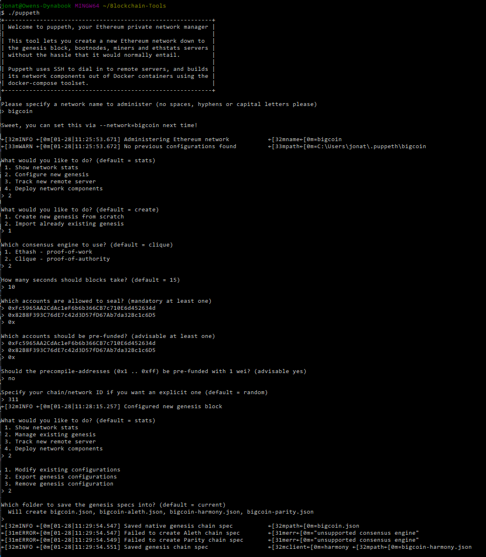
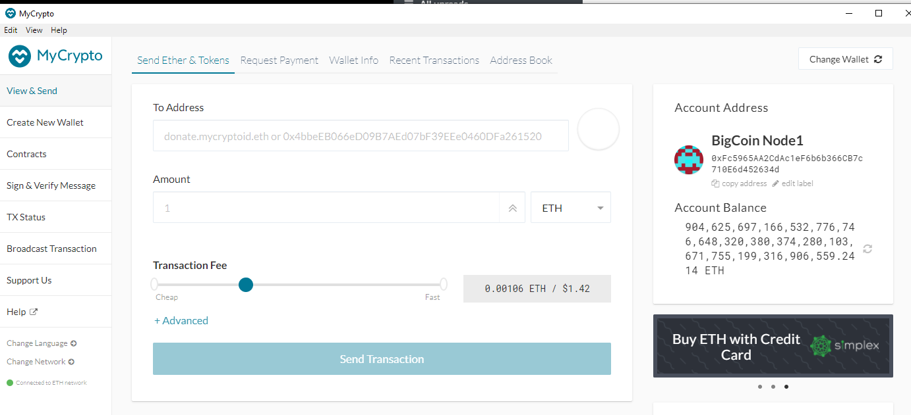
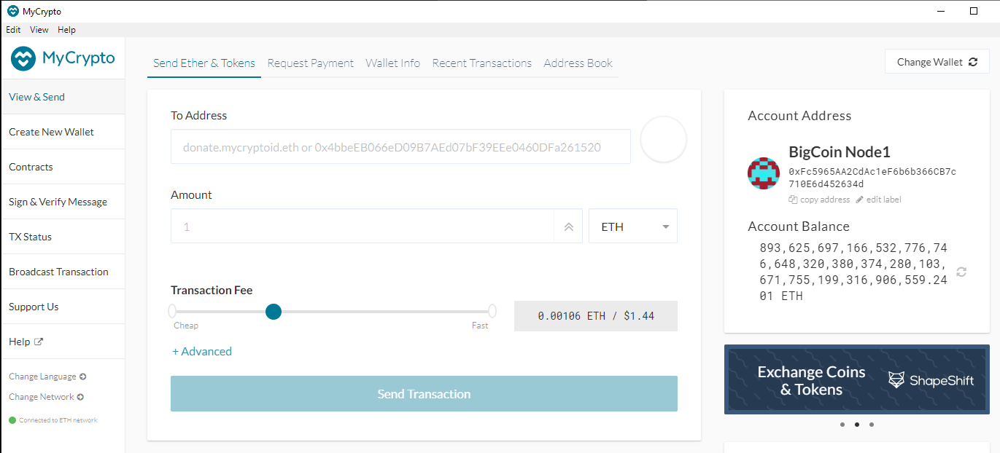
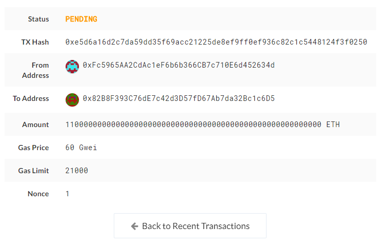

# Proof of Authority Blockchain
The following assignment is to show comprehension and learning of blockchain testnet methods taught by the Rice University FinTech Bootcamp and 2U.  This is a hypothetical scenario and tokens inherently have no value here.[1]

---

## Table of contents
* [General Information](#general-information)
* [Screenshots](#screenshots)
* [Installation Guide](#installation-guide)
* [Usage](#usage)
* [Sources](#sources)
* [Status](#status)
* [Contributors](#contributors)

---

## General Information

The following repository can be used for our team of developers and I to explore potentials for blockchain at ZBank.  I have decided on setting up a testnet because:

- There is no real money involved, which will give our team of developers the freedom to experiment.

- Testnets allows for offline development.

In order to set up a testnet, the following skills/tools are needed:

- Puppeth, to generate the genesis block.

- Geth, a command-line tool, to create keys, initialize nodes, and connect the nodes together.

- The Clique Proof of Authority algorithm.

Tokens inherently have no value here, so provided pre-configured accounts and nodes for easy setup are available.[1]

---

## Screenshots

* Puppeth configuration

* BigCoin - Before Transaction

* BigCoin - After Transaction

* BigCoin - Transaction Metadata

---

## Installation Guide

### Download MyCrypto

1. Go to https://download.mycrypto.com and download the desktop version of MyCrypto
2. Once the download completes, open the file and navigate through the installation wizard.

### Download and Configure Geth
1. Go to https://geth.ethereum.org/downloads
2. Scroll down to stable releases and download the Go Ethereum and Tools package for 32bit or 64bit version depending on your computer configuration.
3. After the download completes, extract all the file and rename the folder to Blockchain-Tools.

### Download and Configure BigCoin

1. Download the entire repository
2. Open Git Terminal
3. Navigate into the repository file path where you stored the files during the download.
4. Copy both node folders and the bigcoin.json file to the Blockchain-Tools directory.

*See the [Usage](#usage) section below for instructions to run the nodes and make transactions.

---

## Usage

### Starting Node 1

1. Navigate into the Blockchain-Tool folder you created in the Installation Guide section using Git Bash.

2. Run the following command:

./geth --datadir node1 --unlock "Fc5965AA2CdAc1eF6b6b366CB7c710E6d452634d" --mine --rpc --allow-insecure-unlock

* Find the line that shows the enode address and port number.  Copy this as you will need it to start node 2.

### Starting Node 2

1. Open a second Git Bash terminal and navigate into the Blockchain-Tool folder.

2. Run the following command and replace the enode address and port number between the double quotation marks:

./geth --datadir node2 --unlock "82B8F393C76dE7c42d3D57fD67Ab7da32Bc1c6D5" --mine --port 30304 --bootnodes "paste enode address and port number here" --ipcdisable --allow-insecure-unlock

* --mine = tells the node to mine for data
* --rpc = allows for direction peer-to-peer network connection with node 2
* --port = tells the node what specific port to use as it cannot use the same port number as node 1

### Submit Transaction

1. Make sure Node 1 and Node 2 are both running in separate terminals

2. Open MyCrypto and click the Keystore link

3. Browse to the keystore file in the Node 1 folder

4. Click the View and Send tab

5. Enter the Node 2 public key address to specify which account to send bigcoin to along with the amount to send

6. Click the send option and confirm the transaction

7. The transaction history will show pending and then change to successful when complete.

---

## Sources

- [1] https://rice.bootcampcontent.com/Rice-Coding-Bootcamp/rice-hou-fin-pt-09-2020-u-c/tree/master/hw/18-Blockchain/Instructions

---

## Status

Project is: _Complete_

---

## Contributors

* Jonathan Owens
* LinkedIn: www.linkedin.com/in/jonowens
